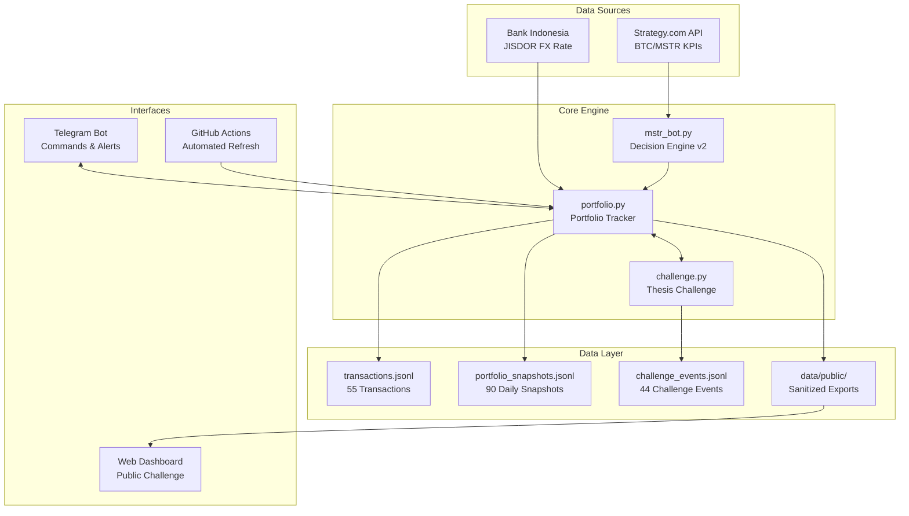

# 📊 MSTR Investment Tracker & Decision Engine

> A quantitative investment tracking system with AI-powered decision engine, real-time market data, portfolio accounting, and live thesis challenge — all managed via Telegram bot and automated CI/CD pipelines.

[](https://github.com/stevendiyanto76-oss/mstr-investment-tracker/actions)
[](https://github.com/stevendiyanto76-oss/mstr-investment-tracker/actions)

---

## 🔍 What Is This?

A comprehensive investment tracking and decision-making platform built around **Strategy (formerly MicroStrategy / MSTR)** — the largest corporate holder of Bitcoin.

The system scrapes real-time data from Strategy's public APIs, calculates institutional-grade valuation metrics, generates actionable buy/sell signals, tracks a live investment portfolio with full audit trail, and delivers everything via Telegram bot.

This isn't a toy project. This is a **production system** with 1,100+ commits, automated CI/CD, append-only accounting ledgers, and a publicly verifiable investment thesis challenge.

---

## ✨ Key Features

| Feature | Description |
|---------|-------------|
| 📈 **Decision Engine v2** | Quantitative scoring model: STRONG BUY → ACCUMULATE → HOLD → REDUCE → SELL |
| 💰 **Portfolio Tracker** | Full double-entry accounting with Decimal precision (40-digit) |
| 🏆 **Live Thesis Challenge** | Public investment thesis with verifiable audit trail |
| 🤖 **Telegram Bot** | Complete portfolio management via chat commands |
| 📊 **Market Data Pipeline** | Real-time BTC price, MSTR price, holdings, shares, yield, debt |
| 💱 **FX Conversion** | IDR ↔ USD via Bank Indonesia JISDOR official rate |
| 🔒 **Append-Only Ledger** | Immutable transaction history with hash-chain integrity |
| 📤 **Public Export** | Sanitized data for website dashboard (no private data leaked) |
| ⚙️ **GitHub Actions CI/CD** | Automated portfolio refresh, challenge CI, and validation |
| 🧪 **Test Suite** | Unit tests for portfolio, challenge, and append-only guard |

---

## 🏛️ Architecture



---

## 🚀 Quick Start — Try It Yourself

### 1. Clone & Setup

```bash
git clone https://github.com/stevendiyanto76-oss/mstr-investment-tracker.git
cd mstr-investment-tracker
pip install requests python-dotenv
```

### 2. Explore the Decision Engine

The decision engine works without any API keys — it scrapes public data:

```bash
# Fetch live MSTR/BTC data and run the decision engine
python mstr_bot.py
```

**Example output:**

```text
╔══════════════════════════════════════════════╗
║         MSTR DECISION ENGINE v2              ║
╠══════════════════════════════════════════════╣
║ BTC Price:        $64,589.83                 ║
║ MSTR Price:       $97.58                     ║
║ BTC Holdings:     580,250 BTC                ║
║ Average Cost:     $69,287                    ║
║ Market Cap:       $105.2B                    ║
║ mNAV:             2.81x                      ║
║ BTC Yield YTD:    18.2%                      ║
║                                              ║
║ ► Signal: ACCUMULATE                         ║
║ ► Confidence: 72%                            ║
╚══════════════════════════════════════════════╝
```

### 3. Explore Portfolio Data

The repository includes **294 demo records** of realistic investment data:

```bash
# View portfolio status
python portfolio.py status

# Validate data integrity
python portfolio.py validate

# Export public-safe data
python portfolio.py export-public

# View challenge status
python portfolio.py challenge-status
```

### 4. Run Tests

```bash
python -m pytest tests/ -v
```

### 5. Explore the Data Files

```bash
# View latest transactions
python -c "
import json
with open('data/transactions.jsonl') as f:
    for line in f.readlines()[-5:]:
        tx = json.loads(line)
        print(f\"{tx['event_id']} | {tx['event_type']:7s} | {tx['quantity']:>5s} MSTR @ ${tx['price_usd']}\")
"
```

**Example output:**

```text
TX-000048 | BUY     |  2.15 MSTR @ $132.45
TX-000049 | SELL    |  0.87 MSTR @ $128.91
TX-000050 | BUY     |  3.22 MSTR @ $135.67
TX-000051 | DEPOSIT |  None MSTR @ $None
TX-000052 | BUY     |  1.44 MSTR @ $138.23
```

### 6. Setup Telegram Bot (Optional)

To enable the Telegram bot for live portfolio management:

```bash
# Create .env file
cp .env.example .env  # or create manually
```

Add to `.env`:

```env
TELEGRAM_BOT_TOKEN=your_bot_token_from_@BotFather
TELEGRAM_CHAT_ID=your_chat_id
```

Then run the portfolio tracker in polling mode:

```bash
python portfolio.py run
```

---

## 🤖 Decision Engine v2

The engine scrapes live data from Strategy's public endpoints and computes:

| Metric | Source |
|--------|--------|
| BTC Price & MSTR Price | `api.strategy.com` |
| BTC Holdings & Average Cost | Strategy purchases page |
| Basic & Diluted Shares | Strategy shares page |
| BTC Yield (QTD/YTD) | Computed from holdings data |
| Market Cap & mNAV | Derived valuation |
| Total Debt & Maturity Profile | Strategy debt page |

These feed into a **scoring model** that outputs one of five zones:

```text
STRONG BUY ← deeply undervalued, high conviction
ACCUMULATE ← moderately attractive
HOLD       ← fair value zone
REDUCE     ← moderately overvalued
SELL       ← significantly overvalued
```

---

## 💬 Telegram Commands

```text
/buy_mstr <qty> <price>     — Record a buy transaction
/sell_mstr <qty> <price>    — Record a sell transaction
/portofolio                 — View current portfolio summary
/history <n>                — Show last N transactions
/deposit USD <amount>       — Add cash deposit
/withdraw USD <amount>      — Withdraw cash
/fx_convert IDR 16M USD 100 — Currency conversion (IDR → USD)
/fee USD <amount>           — Record broker/exchange fee
/tax USD <amount>           — Record tax payment
/undo <event_id>            — Reverse a specific transaction
/challenge_status           — View live thesis challenge status
/cash                       — Check cash balance
```

---

## 🔒 Accounting Integrity

- **Decimal precision** — All calculations use Python `Decimal` with 40-digit precision
- **Append-only ledger** — Transactions are never modified, only appended or undone
- **Hash-chain validation** — CI pipeline verifies ledger integrity on every commit
- **Deterministic replay** — Portfolio state can be reconstructed from the ledger alone
- **Public/private separation** — Private fields (chat IDs, Telegram metadata) are stripped from public exports

---

## 📁 Project Structure

```text
mstr-investment-tracker/
│
├── mstr_bot.py                      # Decision Engine v2 (900 lines)
│                                    #   - Market data scraping
│                                    #   - Valuation metrics calculation
│                                    #   - Buy/sell signal generation
│
├── portfolio.py                     # Portfolio Tracker (2,300 lines)
│                                    #   - Transaction recording & replay
│                                    #   - P&L calculation (Decimal precision)
│                                    #   - Daily snapshot generation
│                                    #   - Telegram bot command handler
│                                    #   - FX conversion (BI JISDOR)
│                                    #   - Public data export
│
├── challenge.py                     # Live Thesis Challenge (2,400 lines)
│                                    #   - Separate challenge ledger
│                                    #   - Era management (reset/pause)
│                                    #   - Public audit trail
│                                    #   - Performance calculation
│
├── CHALLENGE.md                     # Challenge rules & documentation
├── mstr_decision_engine_v2_state.json
│
├── data/
│   ├── transactions.jsonl           # 55 portfolio transactions
│   ├── portfolio_snapshots.jsonl    # 90 daily snapshots
│   ├── portfolio_state.json         # Current portfolio state
│   ├── challenge_config.json        # Challenge configuration
│   ├── challenge_events.jsonl       # 44 challenge events
│   ├── challenge_snapshots.jsonl    # 105 challenge snapshots
│   ├── mstr_disclosure_history.jsonl
│   └── public/                      # 7 sanitized export files
│       ├── challenge_overview.json
│       ├── challenge_transactions.json
│       ├── challenge_performance.json
│       ├── challenge_thesis.json
│       ├── challenge_audit.json
│       ├── challenge_health.json
│       └── v2_authority_manifest.json
│
├── tests/                           # Unit test suite
│   ├── test_portfolio.py
│   ├── test_challenge.py
│   └── test_append_only_guard.py
│
├── tools/                           # Validation utilities
│   └── check_append_only_prefix.py
│
└── .github/workflows/               # CI/CD automation
    ├── mstr_tracker.yml             # Scheduled portfolio refresh
    ├── portfolio_refresh_v2.yml     # V2 refresh pipeline
    ├── challenge_ci.yml             # Challenge validation
    └── challenge_freshness_notes.md
```

---

## 📊 Demo Data Included

This repository includes **294 realistic demo records** so you can explore the system immediately:

| Dataset | Records | Description |
|---------|---------|-------------|
| Portfolio Transactions | 55 | Buy/sell/deposit events over 12 months |
| Portfolio Snapshots | 90 | Daily portfolio valuations with BTC/MSTR prices |
| Challenge Events | 44 | Thesis challenge trades and deposits |
| Challenge Snapshots | 105 | Challenge performance tracking |
| Public Exports | 7 files | Sanitized data for web dashboard |

All data is fictional demo data — no real financial information is exposed.

---

## 🛠️ Tech Stack

| Component | Technology |
|-----------|------------|
| Language | Python 3.11+ |
| Bot Framework | Telegram Bot API (raw HTTP, no wrapper library) |
| Data Sources | Strategy.com API, Bank Indonesia JISDOR |
| Precision | Python `Decimal` (40-digit) |
| Storage | JSONL append-only ledgers |
| FX Rates | BI JISDOR XML web service |
| CI/CD | GitHub Actions (4 automated pipelines) |
| Testing | pytest |

---

## 📈 Project Stats

| Metric | Value |
|--------|-------|
| Production commits | 1,100+ |
| mstr_bot.py | ~900 lines |
| portfolio.py | ~2,300 lines |
| challenge.py | ~2,400 lines |
| Total codebase | 5,600+ lines |
| Demo data records | 294 |
| CI/CD workflows | 4 pipelines |
| Test coverage | 3 test modules |

---

## 📄 License

MIT License — free to use and modify with attribution.

---

*Built by Steven Diyanto — where quantitative investment analysis meets software engineering.*
